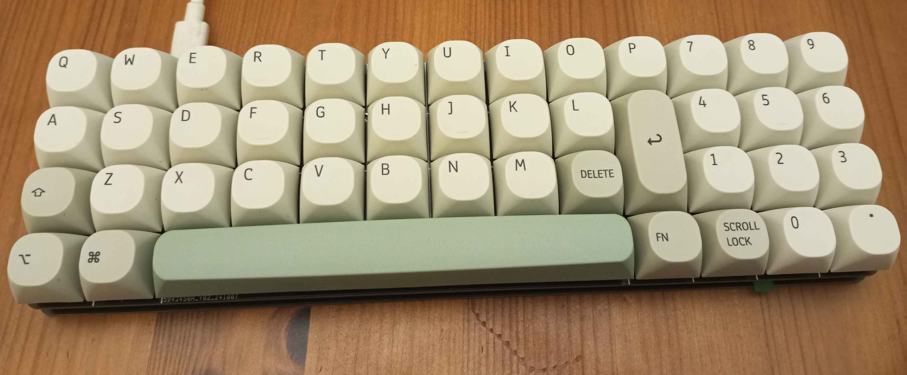

# Num13

**Num13** is a 45-key compact ortholinear mechanical keyboard which includes a **Num**pad and is **13**Ux4U in size, which I designed for my own personal use.

The build is composed of 2 PCBs, the **top** pcb includes the key matrix (MX switches or low-profile Redragon switches w/ plate stabs), while the **bottom** includes the keyboard controller (a pi pico), a status led (rgb on the rB revision included here), and serves as the base of the keyboard structure itself.